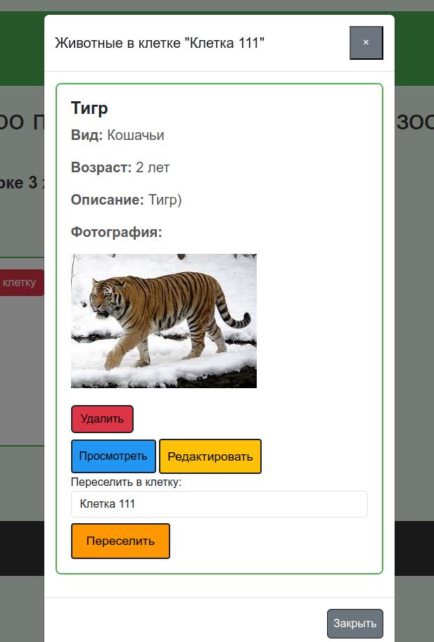

# Virtual Zoo

Virtual Zoo — это веб-приложение, созданное с использованием фреймворка Laravel, которое позволяет пользователям взаимодействовать с виртуальным зоопарком.

## Функционал
- Животные и клетки: Пользователи могут добавлять, редактировать и удалять животных и клетки. Каждое животное привязано к клетке.

- Переселение животных: Если клетка заполнена, пользователю будет предложено переселить животных перед удалением клетки.

- Уведомления: После успешных операций пользователи получают уведомления, например, при добавлении или удалении животных и клеток.

- Модальные окна: Используются для просмотра животных в клетке.

## Превью сайта


## Установка
1. **Клонируйте репозиторий:**
```bash
   git clone https://github.com/Vital1tch/virtual-zoo.git
```
2. **Перейдите в директорию проекта:**
```bash
cd virtual-zoo
```
3. **Установите зависимости с помощью Composer:**
```bash
composer install
```
4. **Настройте файл окружения .env. Например:**
```
 DB_CONNECTION=mysql
 DB_HOST=127.0.0.1
 DB_PORT=3306
 DB_DATABASE= имя вашей БД
 DB_USERNAME= имя пользователя БД
 DB_PASSWORD= пароль пользователя
```
5. **Генерация ключа приложения**
```bash
php artisan key:generate
````
6. **Выполните команду для миграций в БД**
```bash
php artisan migrate
```
7. **Выполните команду для создания storage link - хранение фотографий животных**
```bash
php artisan storage:link
```
8. **Запустите сервер:**
```bash
php artisan serve
```
